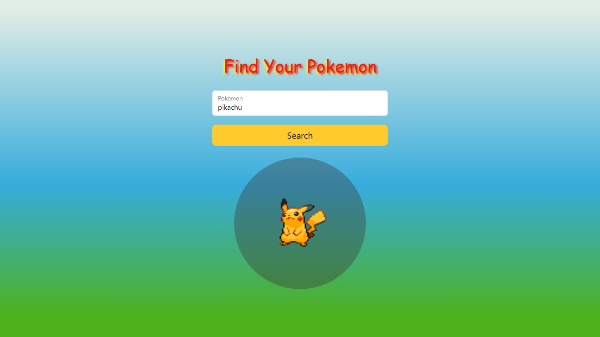

# Find your Pokemon 🚀

## Description 📝:
- This project consists of querying for a specific pokemon and then showing it to you.
- For this project, an API query (pokeApi) was made to then search for the data of pokemons.
- There were some complications with accessing the API with VUE but the expected result could be achieved.
- URL: https://juanrcoder.github.io/Project-Find_Pokemon/

## Languajes / Tools📌:
- HTML
- CSS
- JavaScript - jQuery
- Vue.js
- Api REST (PokeApi)
- VSCode

## Authors:
- Juan Ramirez 😃
- Oscar Morales 😃 - [Github](https://github.com/0skarmp)
